# Zauberspiegel

<iframe width="100%" height="420px" src="https://www.youtube.com/embed/XhVIUVY8d2w" frameborder="0" allow="accelerometer; autoplay; encrypted-media; gyroscope; picture-in-picture" allowfullscreen></iframe>

The Zauberspiegel was my contribution to the event Ghost Cinema. It is a site-specific installation with which one can see through time and between dimensions of everyday reality and the realities of old movies, particularly of German expressionism. Through the mirror the face image of who is in front of Zauberspiegel merges with the face
of an iconic character from the movies of yore. So it creates a communication channel that works in both directions. The characters become human and ordinary people interact with a scene from another dimension and another time.

Its design was inspired by the old trick of Amusement Parks where a woman is transformed into a gorilla. The trick is based on the brightness difference on different sides of a mirror that only reflects the side where there is more light. Using the same logic, I used infrared LEDs, a webcam, a glass with a semi-transparent black coating on one side, and a white screen on the other. Behind all a projector projecting the characters’ faces just when there was movement.

From the event’s release, written by Paola Barreto:

> The extinction of movie theater is a global phenomenon that has been observed in the past 30 years across many countries. This can be related to the culture of fear, that has been redefining urban spaces and pushed cinemas into shopping centers, but also to new ways of film distribution – television, home video, internet – in which cinemas are no longer a privileged space. If one can say that cinema has always been a ghost – a spectre in a way – what could the ending of old movie palaces teach us about the nature of cinema? To use the portmanteau coined by Gregory Ulmer, what is the mystery in the decadence of these buildings? Ghost Cinema addresses to these questions through a series of video interventions, which occupy deactivated movie theatres. Starting from an affective cartography
of buildings abandoned, demolished or simply transformed into  another activity, the project counts on the spontaneous collaboration of cinema spectators and has been presented in different cities.  
The memories shared in a collaborative network are indexed in a database, and the data is combined and projected over the buildings in a Live Cinema session, mixing materiality, mediality and temporality. As Jacques Derrida affirms, archives are not dealing with the past, but with the future. Ghost Cinema pays a tribute to dead cinemas, bringing them back to life in a mediumistic session, but more than that, it wants do discuss possible futures for the buildings and its surroundings, and new architectures for image sharing.

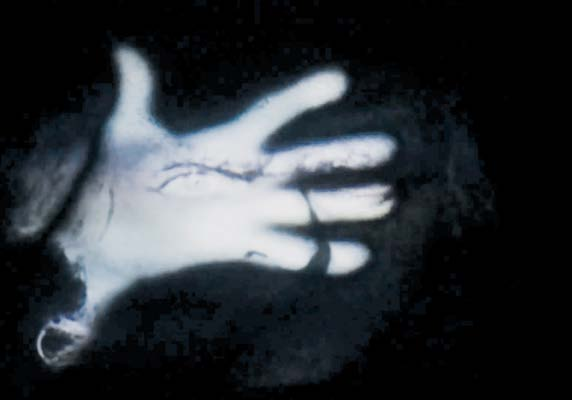

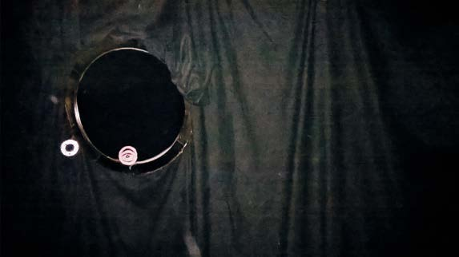
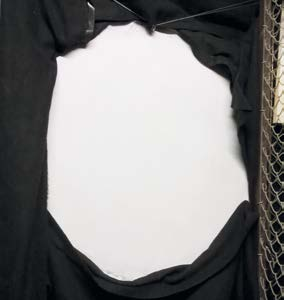
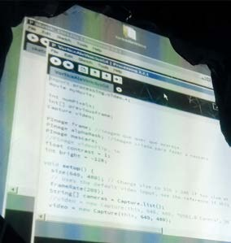
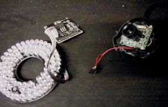
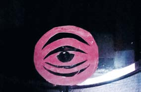

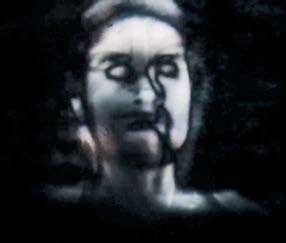

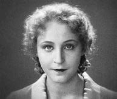
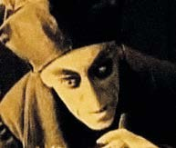
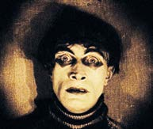
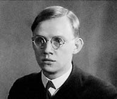
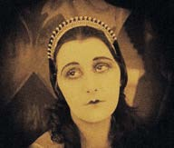

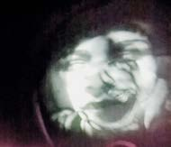

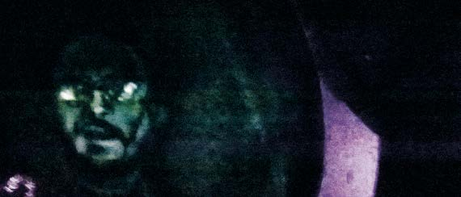

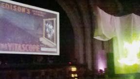
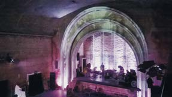
